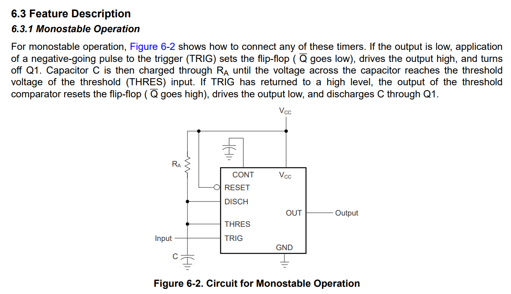
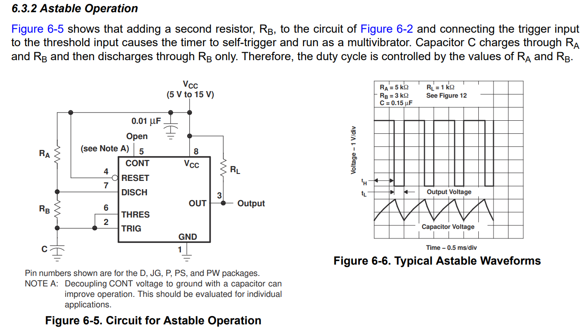
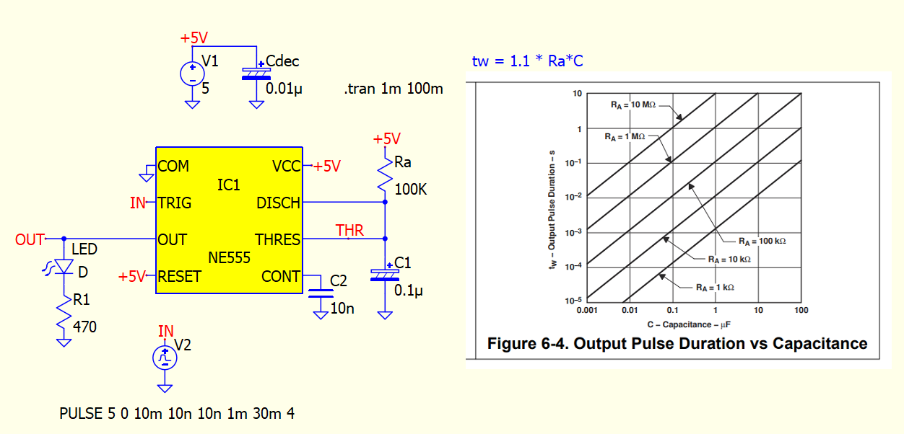
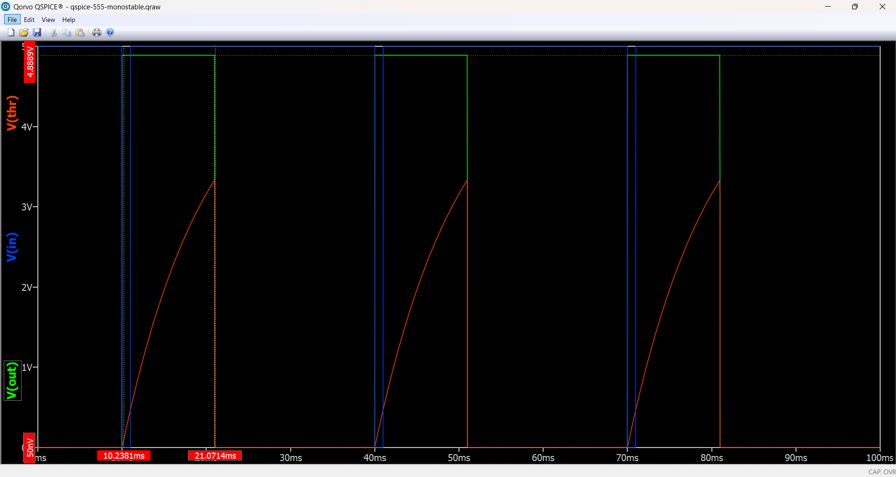
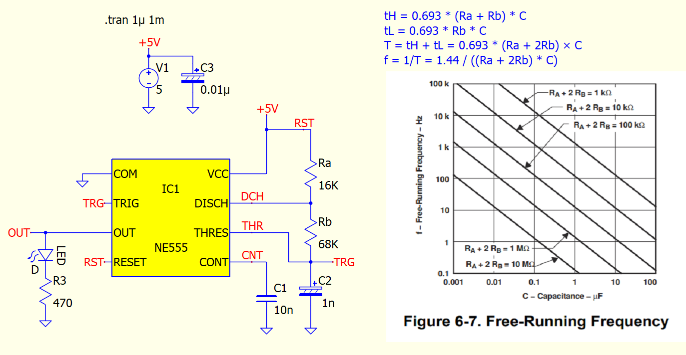
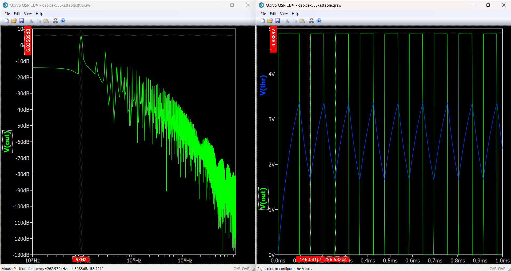

# 555 Qspice Simulation
555 application circuits simulation in Qspice.

## An Introduction to QSPICE
SPICE is a modern, next-generation circuit simulator created by Mike Engelhardt, the original developer of the industry-standard LTspice. Now supported by Qorvo, QSPICE was designed from the ground up to address the limitations of traditional SPICE simulators, particularly when it comes to advanced analog, power, and mixed-signal system processing.

Often considered the spiritual successor to LTspice, QSPICE provides engineers and students with an incredibly fast, accurate, and completely free tool for commercial, educational, and personal using.

## An Introduction to the NE555 Timer IC
The NE555 timer is arguably one of the most famous, versatile, and widely used integrated circuits (ICs) in the history of electronics. Designed by Swiss engineer Hans R. Camenzind in 1971 and introduced by Signetics, this tiny chip revolutionized circuit design by providing a cheap, reliable, and simple way to generate accurate time delays and oscillations.

Despite being over 50 years old, the 555 timer remains a staple in both educational kits and professional industrial applications. Its enduring popularity comes from its robust design, it can handle a wide range of power supply voltages (typically from 4.5V to 15V) and can source or sink enough current to directly drive components like LEDs, small motors, and relays.

## The Two Modes of Operation
The true power of the NE555 lies in its flexibility. By changing how resistors and capacitors are connected to its eight pins, it can operate in two fundamental modes:

### Monostable Mode (One-Shot) 
Here, the timer acts as a "one-shot" pulse generator. When triggered by an external input, the 555 outputs a single pulse of a specific duration (determined by a single resistor and capacitor) before returning to its resting state. This is perfect for creating timers, delay circuits, and debounce switches.

### Astable Mode (Oscillator)
In this mode, the 555 timer acts as a continuous oscillator, outputting a continuous stream of rectangular pulses. This is commonly used for flashing LEDs, generating audio tones, and providing clock signals for digital circuits.

Whether you are a hobbyist blinking your first LED or an engineer designing a complex control system, the NE555 serves as an excellent introduction to analog and digital signal.

## Qspice Circuit Simulation

### Monostable

### Astable

